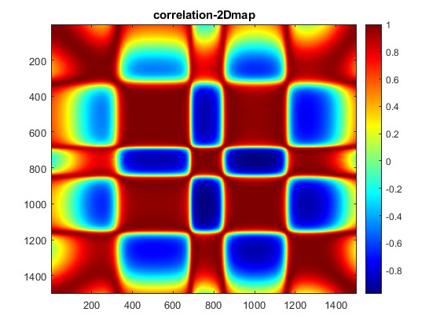
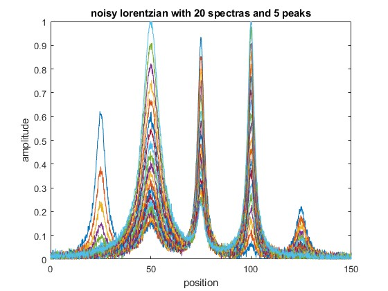
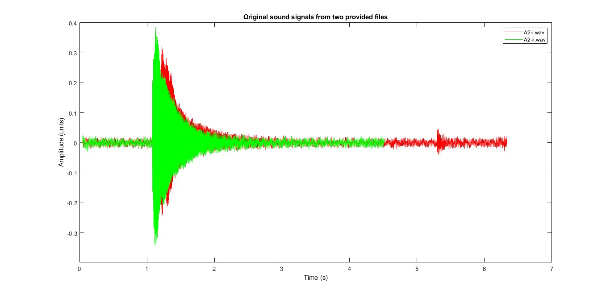
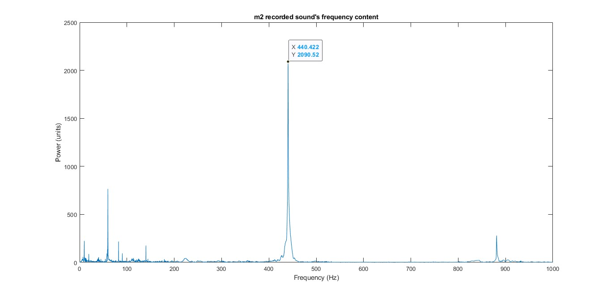

# image processing
Image Processing Techniques

Here are some examples of image and signal processing techniques written primarily in Matlab. More examples are to be added in Python.

## Signal Process Techniques

### correlation_and_lorentzian.m
in this file, creating 2d correlation map and plotting lorentzian curves are provided.

#### example of 2d correlation mapping

#### example of plotting lorentzian in different sets of parameters

### sound_signal_freq_domain.m
load audio file to matlab and transfer the signal to frequency domain using fast fourier transform function.

#### sound signal time domain plot

#### sound signal frequency domain plot

